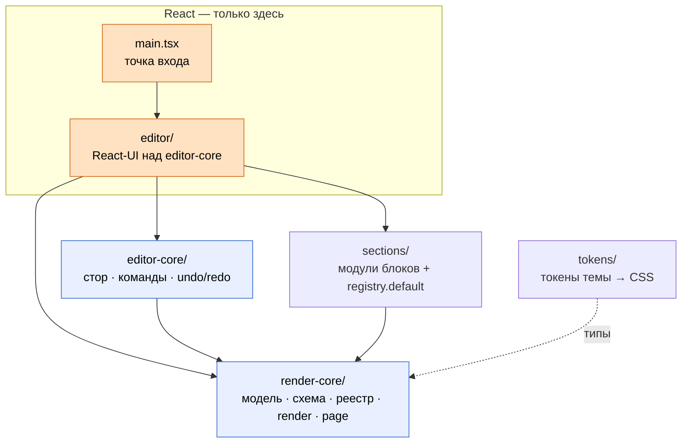

# Архитектура studio (живая карта)

Одна карта вместо чтения четырёх ADR: **какие слои, куда смотрят зависимости, как
течёт документ**. ADR остаются как «почему так решили» — здесь на них ссылки, без
дублирования.

> Карта отражает **актуальное** состояние кода после STUDIO-035: единственный
> редактор — собственный (`editor-core` + `editor`). Источник правды по структуре —
> этот документ и код.

## 1. Рамка: проект — гексагон

Studio построен в парадигме портов и адаптеров (knowledge перенесён из Go — см.
[improvements/roadmap-control.md](improvements/roadmap-control.md)):

| Мир Go                       | studio                                                                                          |
| ---------------------------- | ----------------------------------------------------------------------------------------------- |
| Домен / ядро без фреймворка  | `render-core/` — чистые `(props, ctx) → string`, не знают про React                             |
| Доменная модель / агрегат    | `StudioDocument` — единственный источник правды                                                 |
| Доменные модули              | `sections/` (envelope, hero, closing, …)                                                        |
| Driving-адаптер              | `editor/` — React-UI поверх `editor-core`                                                       |
| Сменная реализация за портом | UI редактора изолирован стором ([ADR-0005](adr/ADR-0005-editor-own-engine.md))                  |

Смысл: на архитектурной оси (границы, направление зависимостей) работаем как в
бэкенде; React — сменная деталь оболочки, а не сердце системы.

## 2. Слои и зависимости

| Слой               | Папка                                           | Ответственность                                                              | Зависит от                        |
| ------------------ | ----------------------------------------------- | ---------------------------------------------------------------------------- | --------------------------------- |
| Ядро (агностичное) | [`src/render-core/`](../src/render-core/)       | модель документа, схема параметров, реестр, render, сборка страницы          | — (ванильный TS)                  |
| Секции             | [`src/sections/`](../src/sections/)             | модули блоков (`BlockModule`) + реестр по умолчанию                          | `render-core`                     |
| Токены             | [`src/tokens/`](../src/tokens/)                 | токены темы (DTCG JSON → CSS), загрузка CSS темы                             | — (типы из `render-core`)         |
| Стор редактора     | [`src/editor-core/`](../src/editor-core/)       | команды, selection, undo/redo над `StudioDocument` (без React)               | `render-core`                     |
| Редактор           | [`src/editor/`](../src/editor/)                 | React-UI: холст, палитра, панель свойств, inline, шапка, темы, экспорт       | `editor-core`, `render-core`, `sections`, React |

Все стрелки зависимостей направлены **внутрь** — к ядру. Ядро ни про кого из
внешних слоёв не знает.



## 3. Правило зависимостей (главный инвариант)

**`render-core/`, `sections/` и `editor-core/` не импортируют React, `react-dom`,
движки редактора и `../editor`.** React живёт только в `src/editor/` и точке входа
`src/main.tsx`. Так прод-выход не тащит React ([ADR-0001](adr/ADR-0001-repo-structure.md),
[ADR-0002](adr/ADR-0002-render-contract.md)).

Граница **проверяется машинно**: правило `no-restricted-imports` в
[`eslint.config.js`](../eslint.config.js) (scoped на `render-core/`, `sections/`,
`editor-core/`) запрещает импорт React, `react-dom`, `@measured/puck`, `@craftjs/core`
и `../editor` — нарушение валит `make lint` (STUDIO-027 / STUDIO-031). Запрет Puck/Craft
оставлен как защита от возврата движка после STUDIO-035.

## 4. Поток данных: документ → HTML/CSS

```
StudioDocument                                  (источник правды, document.ts)
   │
   ▼ renderDocument(doc, { registry })          (render.ts)
   │   обходит секции в порядке order (sortedSections),
   │   для каждого типа зовёт mod.render(props, ctx),
   │   собирает html и дедуплицированный по типу css
   ▼
RenderResult { html, css }                      (types.ts)
   │
   ▼ buildPage(result, { themeCss, baseCss })   (page.ts)
   ▼
полный HTML-документ (<!DOCTYPE> + <style> темы/блоков + <body>)
```

Опорные факты (проверяемы по коду):

- Контракт render — чистая функция `RenderFn = (props, ctx) => string`
  ([`types.ts`](../src/render-core/types.ts)); `RenderContext = { doc }`. Без
  обращения к `document`/`window`/DOM — работает и в Node.
- `renderDocument` ([`render.ts`](../src/render-core/render.ts)) обходит
  `sortedSections(doc)` (порядок — дробный `order`, [`order.ts`](../src/render-core/order.ts)),
  зовёт `registry.get(type)`, при неизвестном типе вставляет HTML-комментарий-заглушку
  (render **не падает**), CSS модуля кладёт один раз на тип.
- Форму документа валидирует zod ([`document.schema.ts`](../src/render-core/document.schema.ts),
  `parseDocument`); параметры блока сужаются по `ParamSchema`
  ([`schema.ts`](../src/render-core/schema.ts), `parseBySchema`/`defaultsFromSchema`).
- Тема: токены DTCG → CSS (Style Dictionary), загрузка по `theme.id`
  ([`src/tokens/theme.ts`](../src/tokens/theme.ts), `loadThemeCss`/`resolveThemeCss`);
  CSS темы инжектится в `buildPage`.

**Один путь рендера.** Тот же `renderDocument` / `mod.render` используется и в
превью редактора (`BlockPreview`), и в статическом экспорте (Node, без React) —
это анти-drift и анти-bloat ([ADR-0002](adr/ADR-0002-render-contract.md)).

## 5. Изоляция движка редактора

Собственный редактор не рендерит блоки «по-своему» — оборачивает наш строковый
render:

- [`BlockPreview`](../src/editor/block-preview.tsx) зовёт `mod.render(props, ctx)`
  и вставляет результат через `dangerouslySetInnerHTML`. Второго пути разметки нет.
- Панель свойств строится из `ParamSchema` модуля
  ([`schema-fields.tsx`](../src/editor/schema-fields.tsx)).
- Источник правды — `StudioDocument` в [`editor-core`](../src/editor-core/); UI
  подписывается на стор, адаптера документ↔движок нет.

Границу держат `editor-core` (без React) и ESLint-ограждения. Замена оболочки —
переписать `src/editor/`, не трогая ядро ([ADR-0005](adr/ADR-0005-editor-own-engine.md)).

## 6. Карта файлов ядра (`render-core/`)

| Файл                                                          | Ответственность                                                                                        |
| ------------------------------------------------------------- | ------------------------------------------------------------------------------------------------------ |
| [`document.ts`](../src/render-core/document.ts)               | `StudioDocument`, `SectionNode`; операции `addSection`/`moveSection`/`removeSection`; `sortedSections` |
| [`document.schema.ts`](../src/render-core/document.schema.ts) | zod-схема формы документа; `parseDocument`                                                             |
| [`schema.ts`](../src/render-core/schema.ts)                   | `ParamSchema` (range/color/text/select); `defaultsFromSchema`, `parseBySchema`                         |
| [`types.ts`](../src/render-core/types.ts)                     | `RenderFn`, `RenderContext`, `BlockModule`, `RenderResult`                                             |
| [`registry.ts`](../src/render-core/registry.ts)               | `createRegistry`, `defineBlock` (стирание `P` через рантайм-парсер)                                    |
| [`render.ts`](../src/render-core/render.ts)                   | `renderDocument` — обход секций, сборка html + css                                                     |
| [`page.ts`](../src/render-core/page.ts)                       | `buildPage` — полный HTML-документ (тема + CSS блоков + body)                                          |
| [`order.ts`](../src/render-core/order.ts)                     | `orderBetween` — дробный индекс порядка                                                                |

## 7. Почему так (ADR)

Эта карта сводит решения в одно место; обоснования — в ADR:

- [ADR-0001](adr/ADR-0001-repo-structure.md) — один пакет (не монорепо); граница
  «агностичный render vs React-оболочка» теперь проверяется линтом (STUDIO-027).
- [ADR-0002](adr/ADR-0002-render-contract.md) — контракт агностичного render
  (`(props, ctx) → строка`); один путь рендера; гранулярность inline (якоря `data-prop`).
- [ADR-0003](adr/ADR-0003-schema-format.md) — формат схемы параметров (`ParamSchema`),
  schema-driven панель.
- [ADR-0004](adr/ADR-0004-editor-base.md) — основа редактора на Puck (superseded;
  историческое, до STUDIO-035).
- [ADR-0005](adr/ADR-0005-editor-own-engine.md) — собственный движок редактора;
  `@measured/puck` удалён.

## Ссылки

- [improvements/roadmap-control.md](improvements/roadmap-control.md) — гексагон,
  таблица Go ↔ studio, R1 (машинные границы импортов — сделано в STUDIO-027).
- [improvements/roadmap-docs.md](improvements/roadmap-docs.md) — план документации (D1–D8).
- [docs/glossary.md](glossary.md) — единый словарь терминов (D2).
- [CLAUDE.md](../CLAUDE.md) — правила и границы для ИИ (контекст у источника).
