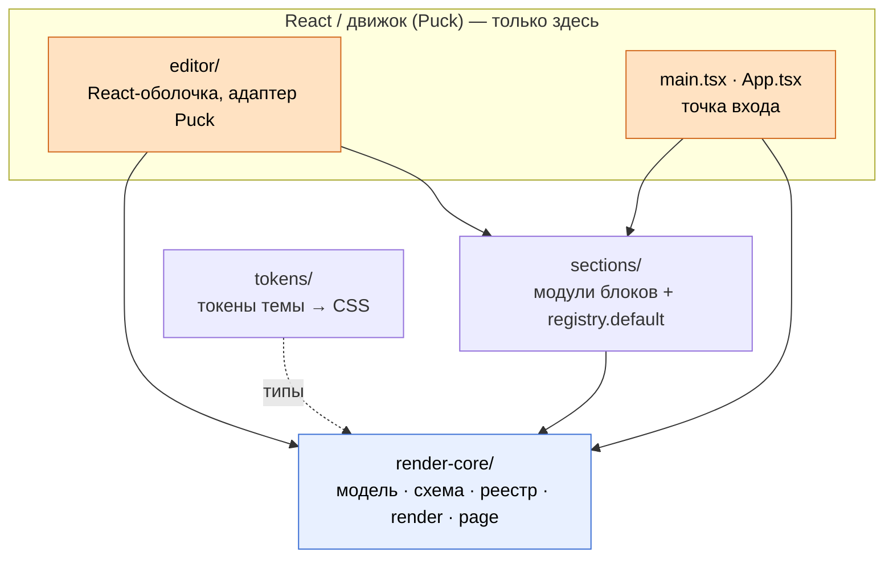

# Архитектура studio (живая карта)

Одна карта вместо чтения четырёх ADR: **какие слои, куда смотрят зависимости, как
течёт документ**. ADR остаются как «почему так решили» — здесь на них ссылки, без
дублирования.

> Карта отражает **актуальное** состояние кода (ранний этап Фазы 1: `src/editor/`
> уже существует). Корневой [README](../README.md) местами описывает Фазу 0 «без
> редактора» — он отстаёт; источник правды по структуре — этот документ и код.

## 1. Рамка: проект — гексагон

Studio построен в парадигме портов и адаптеров (knowledge перенесён из Go — см.
[improvements/roadmap-control.md](improvements/roadmap-control.md)):

| Мир Go | studio |
|---|---|
| Домен / ядро без фреймворка | `render-core/` — чистые `(props, ctx) → string`, не знают про React |
| Доменная модель / агрегат | `StudioDocument` — единственный источник правды |
| Доменные модули | `sections/` (envelope, hero, closing) |
| Driving-адаптер | `editor/` — React-оболочка на Puck, тонкий маппинг в/из `StudioDocument` |
| Сменная реализация за портом | движок Puck, изолирован адаптером ([ADR-0004](adr/ADR-0004-editor-base.md)) |

Смысл: на архитектурной оси (границы, направление зависимостей) работаем как в
бэкенде; React/Puck — сменная деталь за адаптером, а не сердце системы.

## 2. Слои и зависимости

| Слой | Папка | Ответственность | Зависит от |
|---|---|---|---|
| Ядро (агностичное) | [`src/render-core/`](../src/render-core/) | модель документа, схема параметров, реестр, render, сборка страницы | — (ванильный TS) |
| Секции | [`src/sections/`](../src/sections/) | модули блоков (`BlockModule`) + реестр по умолчанию | `render-core` |
| Токены | [`src/tokens/`](../src/tokens/) | токены темы (DTCG JSON → CSS), загрузка CSS темы | — (типы из `render-core`) |
| Редактор | [`src/editor/`](../src/editor/) | React-оболочка на Puck, маппинг модели ↔ Puck, превью | `render-core`, `sections`, Puck, React |

Все стрелки зависимостей направлены **внутрь** — к ядру. Ядро ни про кого из
внешних слоёв не знает.



## 3. Правило зависимостей (главный инвариант)

**`render-core/` и `sections/` не импортируют React, `react-dom`, `@measured/puck`
и `../editor`.** React и Puck живут только в `src/editor/` и точке входа
`src/main.tsx`. Так прод-выход не тащит React ([ADR-0001](adr/ADR-0001-repo-structure.md),
[ADR-0002](adr/ADR-0002-render-contract.md)).

Граница **проверяется машинно**: правило `no-restricted-imports` в
[`eslint.config.js`](../eslint.config.js) (scoped на `render-core/` и `sections/`)
запрещает импорт React, `react-dom`, `@measured/puck`, `@craftjs/core` и `../editor`
— нарушение валит `make lint` (сделано в STUDIO-027, пункт R1 из
[improvements/roadmap-control.md](improvements/roadmap-control.md)). В адаптере Puck
([`src/editor/puck-adapter.ts`](../src/editor/puck-adapter.ts)) импорты из Puck —
только `import type` (кроме точки входа `Editor.tsx`), чтобы тип движка не утекал в
рантайм-зависимости.

## 4. Поток данных: документ → HTML/CSS

```
StudioDocument                                  (источник правды, document.ts)
   │
   ▼ renderDocument(doc, { registry })          (render.ts)
   │   обходит секции в порядке order (sortedSections),
   │   для каждого типа зовёт mod.render(props, ctx),
   │   собирает html и дедуплицированный по типу css
   ▼
RenderResult { html, css }                      (types.ts)
   │
   ▼ buildPage(result, { themeCss, baseCss })   (page.ts)
   ▼
полный HTML-документ (<!DOCTYPE> + <style> темы/блоков + <body>)
```

Опорные факты (проверяемы по коду):

- Контракт render — чистая функция `RenderFn = (props, ctx) => string`
  ([`types.ts`](../src/render-core/types.ts)); `RenderContext = { doc }`. Без
  обращения к `document`/`window`/DOM — работает и в Node.
- `renderDocument` ([`render.ts`](../src/render-core/render.ts)) обходит
  `sortedSections(doc)` (порядок — дробный `order`, [`order.ts`](../src/render-core/order.ts)),
  зовёт `registry.get(type)`, при неизвестном типе вставляет HTML-комментарий-заглушку
  (render **не падает**), CSS модуля кладёт один раз на тип.
- Форму документа валидирует zod ([`document.schema.ts`](../src/render-core/document.schema.ts),
  `parseDocument`); параметры блока сужаются по `ParamSchema`
  ([`schema.ts`](../src/render-core/schema.ts), `parseBySchema`/`defaultsFromSchema`).
- Тема: токены DTCG → CSS (Style Dictionary), загрузка по `theme.id`
  ([`src/tokens/theme.ts`](../src/tokens/theme.ts), `loadThemeCss`/`resolveThemeCss`);
  CSS темы инжектится в `buildPage`.

**Один путь рендера.** Тот же `renderDocument` используется и в превью редактора, и
в статическом экспорте (Node, без React) — это анти-drift и анти-bloat
([ADR-0002](adr/ADR-0002-render-contract.md)).

## 5. Изоляция движка (адаптер Puck)

Puck редактирует дерево React-компонентов, но **не рендерит блоки по-своему** —
оборачивает наш строковый render:

- На каждый тип блока — Puck-компонент, чей React-`render` — обёртка
  [`BlockPreview`](../src/editor/block-preview.tsx): зовёт `mod.render(props, ctx)`
  и вставляет результат через `dangerouslySetInnerHTML`. Второго пути разметки нет —
  тот же `mod.render`, что в экспорте (анти-drift).
- Панель свойств генерируется из `ParamSchema` модуля
  ([`fields-from-schema.ts`](../src/editor/fields-from-schema.ts)).
- Модель Puck маппится в/из `StudioDocument`
  ([`puck-adapter.ts`](../src/editor/puck-adapter.ts): `documentToPuck` /
  `puckToDocument`); порядок секций — дробный `order`, пересчитывается по минимуму.

Источник правды остаётся `StudioDocument`; Puck — сменная деталь за тонким
адаптером. Поэтому замена движка — переписать `src/editor/`, не трогая ядро
([ADR-0004](adr/ADR-0004-editor-base.md), финальный выбор движка отложен).

## 6. Карта файлов ядра (`render-core/`)

| Файл | Ответственность |
|---|---|
| [`document.ts`](../src/render-core/document.ts) | `StudioDocument`, `SectionNode`; операции `addSection`/`moveSection`/`removeSection`; `sortedSections` |
| [`document.schema.ts`](../src/render-core/document.schema.ts) | zod-схема формы документа; `parseDocument` |
| [`schema.ts`](../src/render-core/schema.ts) | `ParamSchema` (range/color/text/select); `defaultsFromSchema`, `parseBySchema` |
| [`types.ts`](../src/render-core/types.ts) | `RenderFn`, `RenderContext`, `BlockModule`, `RenderResult` |
| [`registry.ts`](../src/render-core/registry.ts) | `createRegistry`, `defineBlock` (стирание `P` через рантайм-парсер) |
| [`render.ts`](../src/render-core/render.ts) | `renderDocument` — обход секций, сборка html + css |
| [`page.ts`](../src/render-core/page.ts) | `buildPage` — полный HTML-документ (тема + CSS блоков + body) |
| [`order.ts`](../src/render-core/order.ts) | `orderBetween` — дробный индекс порядка |

## 7. Почему так (ADR)

Эта карта сводит решения в одно место; обоснования — в ADR:

- [ADR-0001](adr/ADR-0001-repo-structure.md) — один пакет (не монорепо); граница
  «агностичный render vs React-оболочка» теперь проверяется линтом (STUDIO-027).
- [ADR-0002](adr/ADR-0002-render-contract.md) — контракт агностичного render
  (`(props, ctx) → строка`); один путь рендера; гранулярность inline (якоря `data-prop`).
- [ADR-0003](adr/ADR-0003-schema-format.md) — формат схемы параметров (`ParamSchema`),
  schema-driven панель.
- [ADR-0004](adr/ADR-0004-editor-base.md) — основа редактора (Puck за тонким
  адаптером; финальный выбор движка отложен).

## Ссылки

- [improvements/roadmap-control.md](improvements/roadmap-control.md) — гексагон,
  таблица Go ↔ studio, R1 (машинные границы импортов — сделано в STUDIO-027).
- [improvements/roadmap-docs.md](improvements/roadmap-docs.md) — план документации (D1–D8).
- [docs/glossary.md](glossary.md) — единый словарь терминов (D2).
- [CLAUDE.md](../CLAUDE.md) — правила и границы для ИИ (контекст у источника).
