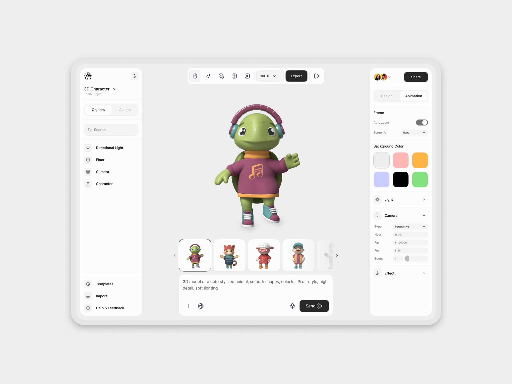
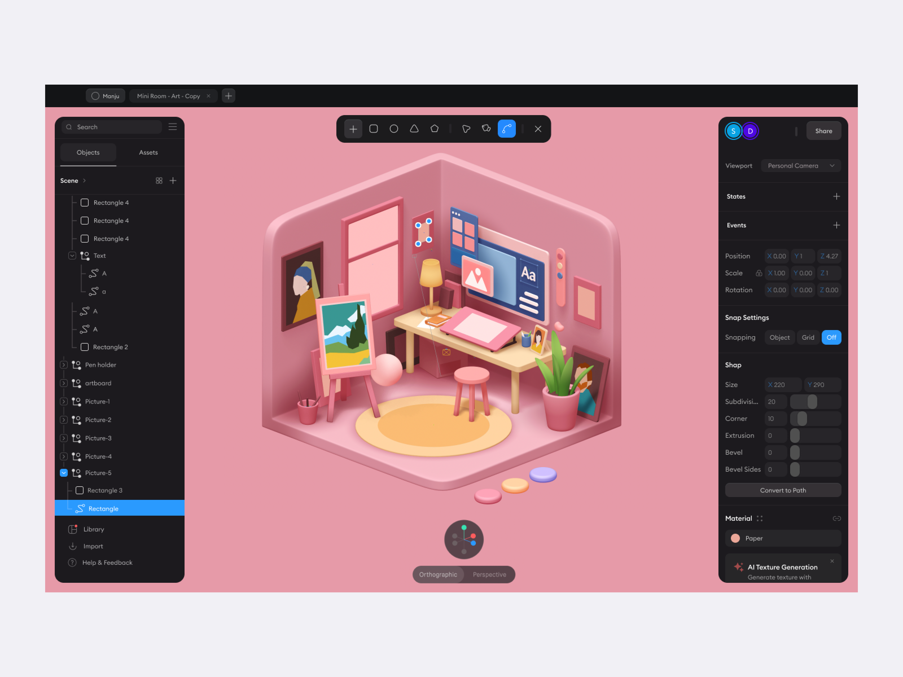

# Референсы дизайна редактора

Собранные референсы и **зафиксированные выводы** из них — сырьё для
[дизайн-системы](../design-system.md). Картинки лежат рядом (CDN-ссылки dribbble
со временем протухают, поэтому копии — в репозитории).

## ref-01 — плавающие панели, светлая тема

Источник: [dribbble](https://cdn.dribbble.com/userupload/46249310/file/29a160c929fb6dd4c486cc012a3b3b3d.png?resize=2048x1536&vertical=center) — редактор 3D-персонажей.

**Что нравится / берём:**

- **Скруглённые рамки** — крупные радиусы у панелей (как у Claude Desktop),
  сейчас в моде и выглядят мягко, не «топорно».
- **Элементы управления «висят в воздухе»**: сайдбар, тулбар и панель свойств —
  отдельные карточки с отступом от краёв экрана, а не сплошные колонки от края
  до края. Это убирает эффект «зажатости» контента в центре.
- Контент (персонаж) — главный: он лежит прямо на фоне сцены, без собственной
  рамки, панели плавают *над* ним.
- Панели держатся мягкой тенью, а не жирным бордером.
- Сдержанная нейтральная палитра хрома: почти нет цвета, один тёмный
  primary-акцент (кнопка Export); цвет приносит сам контент.
- Pill-формы для сегментированных переключателей (Objects/Assets,
  Design/Animation).

## ref-02 — глубина через фон, тёмные панели

Источник: [dribbble](https://cdn.dribbble.com/userupload/15474643/file/original-7818a48183fc8d6f900136ab8d303295.png) — редактор 3D-сцен.

**Что нравится / берём:**

- **Фон создаёт эффект глубины**: сцена занимает весь экран и «уходит под»
  плавающие панели — контент в центре читается как главный и не зажат рамками.
- Та же композиция: плавающий тулбар сверху по центру, панели-карточки слева и
  справа, всё с крупными радиусами.
- Контраст панелей и сцены: панели заметно отличаются по светлоте от фона,
  за счёт этого слои читаются без рамок.

**Что НЕ берём:** тёмный хром. Наш редактор — светлый: свадебные лендинги
светлые и нежные, тёмные панели рядом с ними выглядят чужеродно. Тёмная тема
хрома — возможная опция на будущее, не база.

## Общие выводы (зафиксировано)

1. **Лендинг — главный герой экрана.** Интерфейс редактора — рамка вокруг
   произведения: изящный, лаконичный, не отвлекает на себя внимание. Никаких
   элементов, конкурирующих с холстом по яркости.
2. **Панели плавают, а не прибиты.** Шапка, палитра и панель свойств — карточки
   с воздухом от краёв экрана и мягкой тенью. Сплошных колонок «от края до
   края» и жирных разделителей нет.
3. **Глубина вместо границ.** Слои разводятся светлотой фона и тенью, а не
   бордерами: сцена (фон) — чуть глубже/темнее, панели — светлее и «ближе».
4. **Крупные скругления** у панелей, средние — у контролов, pill — у
   переключателей.
5. **Нейтральный хром + один акцент.** Цвет в интерфейсе — только там, где он
   несёт смысл (выделение, primary-действие, опасное действие); остальное —
   оттенки серого.
